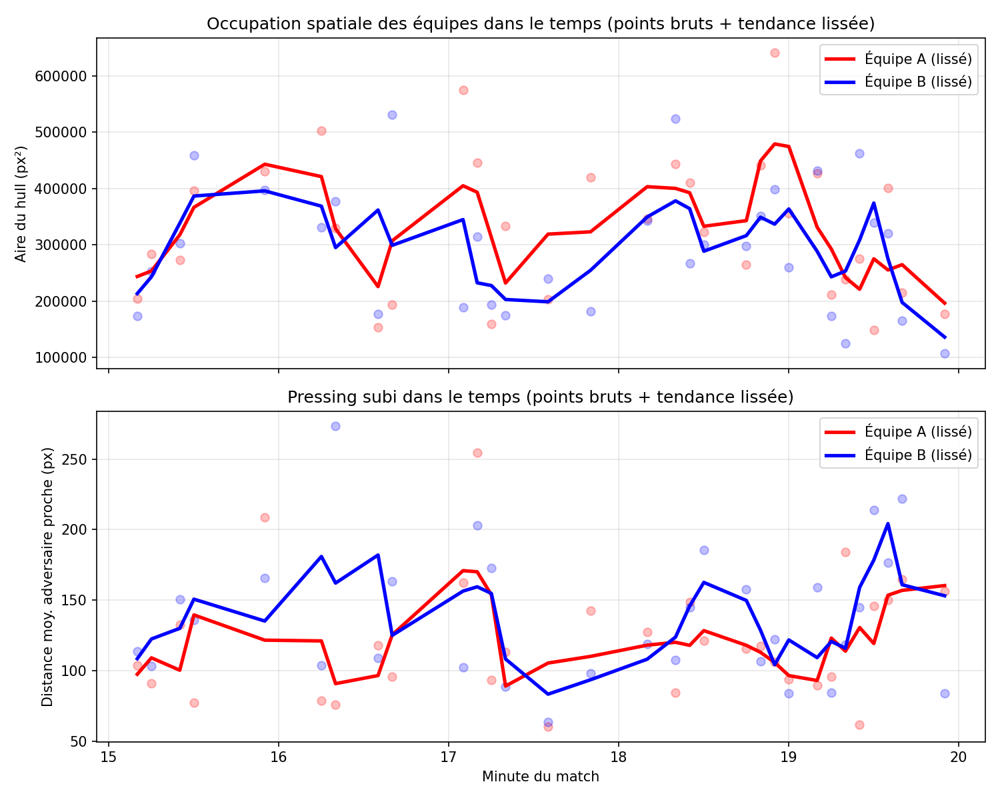

# Pressing & Space Analyzer

Pipeline de computer vision pour l'analyse tactique de matchs de football : détection des joueurs et de l'arbitre, classification par équipe, et calcul de métriques de pressing et d'occupation spatiale — au-delà de la simple détection. Inclut une application interactive pour tester le pipeline sur n'importe quelle vidéo.

## Pourquoi ce projet

La plupart des projets de computer vision appliqués au football s'arrêtent à la détection des joueurs et à la classification par couleur de maillot. Celui-ci va plus loin : il transforme ces détections en métriques tactiques interprétables, inspirées de ce qu'utilisent les clubs professionnels pour analyser le pressing et l'occupation de l'espace — et documente honnêtement les limites rencontrées en cours de route.

## Pipeline

1. Détection — modèle YOLOv8 pré-entraîné (Roboflow football-players-detection-3zvbc), avec tiling (InferenceSlicer) pour améliorer la détection des petits objets
2. Filtrage terrain — masque de couleur (pelouse) pour exclure le personnel technique et les remplaçants en bordure de terrain
3. Classification d'équipe — extraction de la couleur du torse, correction gray-world (compense l'éclairage), masquage de la pelouse dans le recadrage, puis K-means (BGR) pour séparer les deux équipes et l'arbitre
4. Métriques tactiques :
   - Convex hull par équipe → surface occupée (compacité vs étirement)
   - Distance moyenne à l'adversaire le plus proche → indicateur de pressing subi
5. Analyse temporelle — échantillonnage sur une séquence de match, avec filtrage qualité et lissage par moyenne glissante

## Application interactive

Une app Streamlit permet de déposer n'importe quelle vidéo de match, choisir un instant, et visualiser l'analyse sans toucher au code.

cd src
streamlit run app.py

## Résultats — analyse ponctuelle

Sur une frame du match FC Barcelone 0-1 Málaga (La Liga, 21 février 2015) :

| Équipe | Aire hull (px²) | Distance moy. adversaire le plus proche (px) |
|--------|------------------|-----------------------------------------------|
| Équipe A | 419 310 | 251 |
| Équipe B | 269 928 | 181 |

## Résultats — analyse temporelle (minutes 15-20)

Découverte méthodologique importante : le signal frame-par-frame est très bruité sur de la vidéo broadcast (contrairement à une caméra tactique fixe). La cause probable : une caméra broadcast zoome et pivote en continu, donc le sous-ensemble de joueurs visible change à chaque frame. Une moyenne glissante sur 3 échantillons révèle une tendance tactique cohérente malgré ce bruit unitaire.

## Installation

git clone https://github.com/yugerthen/pressing-space-analyzer.git
cd pressing-space-analyzer
python -m venv venv
venv\Scripts\Activate.ps1
pip install -r requirements.txt

Crée un fichier .env à la racine avec ta clé API Roboflow (gratuite sur roboflow.com) :
ROBOFLOW_API_KEY=ta_cle_ici

## Utilisation

Analyse ponctuelle (une frame) :
cd src
python main.py

Analyse temporelle (une séquence) :
python main.py
python plot_metrics.py

Application interactive :
streamlit run app.py

## Structure du projet

src/
detection.py - détection (YOLO + tiling) et prétraitement d'image
team_classifier.py - classification d'équipe par couleur de maillot
tactical_metrics.py - convex hull, indice de pressing, overlay visuel
pitch_mask.py - filtrage des détections hors terrain
main.py - orchestre le pipeline (frame unique ou séquence temporelle)
plot_metrics.py - génère les graphiques d'évolution tactique
app.py - application Streamlit interactive
make_gif.py - assemble des frames annotées en GIF optimisé

## Données

Le clip court de démonstration (GIF) provient d'une vidéo libre de droits (Pexels). L'analyse sur match complet utilise SoccerNet, un dataset de recherche pour la compréhension vidéo du football, sous licence NDA (usage non-commercial, redistribution des vidéos brutes interdite).

## Limitations connues

- Coordonnées en pixels, pas en mètres réels
- Bruit frame-par-frame élevé sur vidéo broadcast, nécessite un lissage temporel
- Résolution source parfois limitée (224p natif, upscale x4)
- Détection du ballon peu fiable
- Classification d'équipe sensible à l'éclairage
- Changements de plan non filtrés en amont

## Pistes d'amélioration

- Homographie pour des métriques en unités réelles (mètres)
- Classifieur de type de plan en amont du pipeline
- Classification d'équipe par embeddings visuels (SigLIP)
- Fine-tuning d'un modèle de détection dédié au ballon
- Tests automatisés et déploiement public de l'application

## Stack technique

Python, YOLOv8 (Roboflow Inference), supervision (ByteTrack, InferenceSlicer), OpenCV, scikit-learn (K-means), Streamlit, pandas, matplotlib, imageio