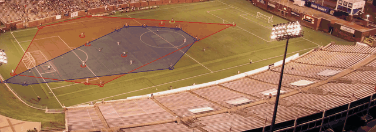
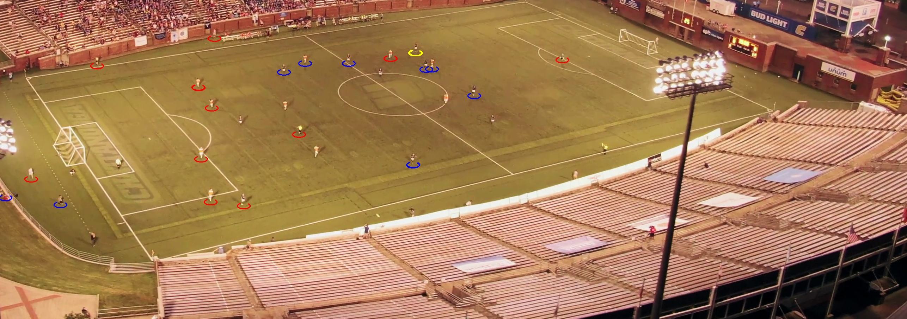

# Pressing & Space Analyzer

Pipeline de computer vision pour l'analyse tactique de matchs de football : détection des 22 joueurs et de l'arbitre, tracking, classification par équipe, et calcul de métriques de pressing et d'occupation spatiale — au-delà de la simple détection.

## Pourquoi ce projet

La plupart des projets de computer vision appliqués au football s'arrêtent à la détection des joueurs et à la classification par couleur de maillot. Celui-ci va plus loin : il transforme ces détections en **métriques tactiques interprétables**, inspirées de ce qu'utilisent les clubs professionnels pour analyser le pressing et l'occupation de l'espace.

## Pipeline

1. **Détection** — modèle YOLOv8 pré-entraîné (Roboflow `football-players-detection-3zvbc`), avec tiling (`InferenceSlicer`) pour améliorer la détection des petits objets (joueurs éloignés)
2. **Tracking** — ByteTrack (`supervision`) pour attribuer un ID stable à chaque joueur à travers les frames
3. **Classification d'équipe** — extraction de la couleur du torse, correction gray-world (compense l'éclairage de stade), masquage de la pelouse, puis K-means (BGR) pour séparer les deux équipes et l'arbitre
4. **Métriques tactiques** :
   - **Convex hull** par équipe → surface occupée (compacité vs étirement)
   - **Distance moyenne à l'adversaire le plus proche** → indicateur de pressing subi

## Résultats

| Équipe | Aire hull (px²) | Distance moy. adversaire le plus proche (px) |
|--------|------------------|-----------------------------------------------|
| Équipe A | 419 310 | 251 |
| Équipe B | 269 928 | 181 |

Sur cette frame, l'équipe B est plus compacte mais subit un pressing plus resserré (adversaires en moyenne plus proches).

## Installation

\`\`\`bash
git clone https://github.com/yugerthen/pressing-space-analyzer.git
cd pressing-space-analyzer
python -m venv venv
venv\Scripts\Activate.ps1
pip install -r requirements.txt
\`\`\`

Crée un fichier `.env` à la racine avec ta clé API Roboflow (gratuite sur [roboflow.com](https://roboflow.com)) :
\`\`\`
ROBOFLOW_API_KEY=ta_cle_ici
\`\`\`

## Utilisation

Place une vidéo de match (vue large, caméra tactique) dans `data/raw/match_clip.mp4`, puis, depuis le dossier `src` :

\`\`\`bash
cd src
python main.py
\`\`\`

Le script génère les frames annotées dans `data/gif_frames/`. Pour assembler un GIF de démo à partir de ces frames :

\`\`\`bash
python make_gif.py
\`\`\`

## Structure du projet

\`\`\`
src/
├── detection.py         # détection (YOLO + tiling) et prétraitement d'image
├── team_classifier.py   # classification d'équipe par couleur de maillot
├── tactical_metrics.py  # convex hull, indice de pressing, overlay visuel
├── main.py               # orchestre le pipeline complet
└── make_gif.py           # assemble les frames annotées en GIF optimisé
\`\`\`

## Limitations connues

- **Coordonnées en pixels, pas en mètres réels** : sans homographie (transformation perspective vers les coordonnées réelles du terrain), les aires et distances ne sont comparables qu'entre elles sur une même frame, pas face à des standards professionnels
- **Classification d'équipe sensible à l'éclairage nocturne** : testé sur un match filmé de nuit sous éclairage de stade (dominante orange/sodium) ; fonctionne après correction gray-world mais serait plus fiable sur un match filmé de jour ou en lumière neutre
- **Détection du ballon peu fiable** : trop petit et rapide pour le modèle générique utilisé
- **Léger bruit résiduel dans le tracking** : quelques faux positifs occasionnels en bordure de terrain (personnel, ramasseurs de balle)

## Pistes d'amélioration

- Homographie via keypoints du terrain pour des métriques en unités réelles (mètres)
- Classification d'équipe par embeddings visuels (SigLIP) plutôt que couleur brute, insensible à l'éclairage
- Fine-tuning d'un modèle de détection dédié au ballon
- Historique temporel des métriques (évolution du pressing sur toute la durée du match, pas une seule frame)
- Ligne défensive et détection de hors-jeu

## Stack technique

Python · YOLOv8 (Roboflow Inference) · supervision (ByteTrack, InferenceSlicer) · OpenCV · scikit-learn (K-means) · imageio